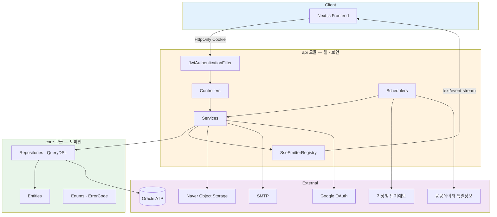

<div align="center">

# 🗓️ ONE SCHEDULE API

### 개인 · 그룹 일정 스케줄러의 백엔드 (Spring Boot 멀티모듈)

<br />

[](https://openjdk.org/)
[](https://spring.io/projects/spring-boot)
[](https://spring.io/projects/spring-security)
[](https://hibernate.org/)
[](https://www.oracle.com/autonomous-database/)
[](https://gradle.org/)

<br />

**[🌐 Service](https://oneschedule.site)** &nbsp; **[📖 Swagger UI](https://api.oneschedule.site/swagger-ui/index.html)** &nbsp; **[💻 Frontend Repo](https://github.com/Wonyes/oneschedule-web)**

<br />

</div>

---

## 📖 목차

- [프로젝트 소개](#-프로젝트-소개)
- [주요 기능](#-주요-기능)
- [기술 스택](#-기술-스택)
- [시스템 아키텍처](#-시스템-아키텍처)
- [기술적 도전과 해결](#-기술적-도전과-해결)
- [API 한눈에 보기](#-api-한눈에-보기)
- [시작하기](#️-시작하기)
- [프로젝트 구조](#-프로젝트-구조)
- [남은 일](#-남은-일)

---

## 💡 프로젝트 소개

**ONE SCHEDULE API**는 개인 일정과 그룹 일정을 하나의 캘린더에서 다루는 스케줄러의 서버입니다.

인증 · 그룹 · 일정 · 알림에 더해, **기상청 단기예보**와 **공공데이터 특일(공휴일)** 정보를 주기적으로 받아 캘린더에 얹어 줍니다.
실시간 알림은 폴링 대신 **SSE**로 밀어 주고, 접속 여부(온라인 표시)도 같은 연결을 재활용해 판정합니다.

<br />

### 🎯 설계 원칙

<table>
<tr>
<td width="25%" align="center">

### 🧱 멀티모듈
`core`(도메인·엔티티)와<br/>`api`(웹·보안) 분리

</td>
<td width="25%" align="center">

### 🍪 HttpOnly 쿠키
토큰을 JS에 노출하지 않고<br/>빌더 한 곳에서 생성

</td>
<td width="25%" align="center">

### 📡 커밋 후 발송
알림은 트랜잭션<br/>`afterCommit`에서만

</td>
<td width="25%" align="center">

### 🔁 중복 제거
`getOrThrow` · 템플릿 enum<br/>· 권한 검증기 공통화

</td>
</tr>
</table>

---

## ✨ 주요 기능

### 🔐 인증 · 회원

<details open>
<summary><b>이메일 인증 가입, Google OAuth, HttpOnly 쿠키 기반 JWT</b></summary>

<br />

| 기능 | 설명 |
| :--- | :--- |
| **✉️ 이메일 인증** | 6자리 코드 발송 · 검증. `VerificationPurpose`로 **회원가입**과 **비밀번호 재설정**이 같은 API를 공유 |
| **🔑 로그인 · 로그아웃** | 액세스(30분) · 리프레시(7일) 토큰을 `HttpOnly` · `Secure` · `SameSite=None` 쿠키로 발급 |
| **♻️ 토큰 재발급** | `POST /v1/api/token-refresh` — 리프레시 토큰으로 액세스 재발급 |
| **🟢 Google OAuth** | `AuthProvider` · `providerId`로 로컬 계정과 소셜 계정을 한 테이블에서 구분 |
| **👤 프로필** | 닉네임 · 이름 · 전화번호 수정, 비밀번호 변경, 프로필 이미지 업로드 |
| **✅ 중복 검사** | 이메일 · 닉네임 실시간 확인 |
| **🔒 인증 시도 제한** | 코드 5회 연속 실패 시 잠금, 재전송하면 해제 |
| **👋 회원 탈퇴** | 개인 일정은 삭제, 그룹 일정은 남기고 작성자만 끊는다. 그룹장이면 승계하거나 혼자면 해체 |

</details>

### 👥 그룹

<details>
<summary><b>초대 코드 · 가입 신청 · 권한 · 온라인 표시</b></summary>

<br />

| 기능 | 설명 |
| :--- | :--- |
| **🎫 그룹 생성 · 참여** | 초대 코드(`groupCode`)로 참여. 공개 그룹은 목록 조회 가능 |
| **📮 가입 신청 흐름** | 신청 → 관리자 승인/거절. `JoinRequestStatus`로 상태 관리, 거절 후 재신청 지원 |
| **🧑‍💼 권한** | `GroupRole`(SUPER 그룹장 · SUB 관리자 · MEMBER). `isManager()`로 판정을 한 곳에 모음 |
| **👑 그룹장 위임** | 그룹장만 넘길 수 있고, 넘기는 즉시 본인은 관리자로 내려가 그룹장이 항상 한 명 |
| **⚙️ 그룹 관리** | 이름 · 공개 설정 · 프로필 이미지 변경, 멤버 내보내기, 그룹 해체 |
| **🟢 온라인 멤버** | SSE 연결 유무 + `lastSeenAt`으로 그룹 내 접속 중인 멤버 조회 |

</details>

### 📅 일정

<details>
<summary><b>개인 · 그룹 일정, 참여자, 종일/다일 일정</b></summary>

<br />

| 기능 | 설명 |
| :--- | :--- |
| **🗓️ 개인 · 그룹 일정** | 같은 엔티티에서 `group`의 유무로 구분. 기간 조회는 QueryDSL |
| **⏱️ 시간 모델** | `startDate`/`endDate` + `startTime`/`endTime` — 시간이 없으면 종일, 날짜가 다르면 다일 일정 |
| **🏷️ 카테고리** | `ScheduleCategory` enum + 컨버터 |
| **👥 참여자** | 그룹 일정에 참여자 지정. 추가 · 제외 시 당사자에게 알림 |
| **🔒 권한** | 등록자만 수정 · 삭제 |

</details>

### 🔔 알림 · 실시간

<details>
<summary><b>SSE 푸시, 18종 템플릿, 1시간 전 리마인더</b></summary>

<br />

| 기능 | 설명 |
| :--- | :--- |
| **📡 SSE 구독** | `GET /v1/api/sse/subscribe` — 30분 타임아웃, 20초 하트비트, 멤버당 다중 연결 허용 |
| **🔔 알림 18종** | 가입 신청 · 승인 · 거절 · 새 멤버 · 탈퇴 · 권한 변경 · **그룹장 변경** · 그룹 해체 · 일정 생성/변경/취소 · 참여자 추가/제외 · 리마인더 · 비밀번호 변경 · 가입 환영 |
| **📍 이동 경로** | 일정 알림은 `scheduleDate`를 함께 실어, 클릭하면 그 날짜의 일간 뷰로 바로 간다 |
| **🧾 템플릿** | 문구를 `NotificationType`의 `template`에 모으고 `message(...)`로 채움 — 서비스 코드에 문자열이 흩어지지 않음 |
| **⏰ 리마인더** | 매분 스케줄러가 1시간 뒤 시작하는 일정을 찾아 발송, `remindedAt`으로 중복 방지 |
| **📥 읽음 처리** | 개별 읽음 · 전체 읽음 · 안 읽은 수 조회, 페이징 목록 |

</details>

### 🌦️ 공공데이터

<details>
<summary><b>기상청 단기예보 · 특일 정보</b></summary>

<br />

| 기능 | 설명 |
| :--- | :--- |
| **🌤️ 날씨** | 격자 좌표(nx, ny) 기준 단기예보를 **매시 정각** 수집, 매일 03:00 정리 |
| **🎌 공휴일** | 특일 정보를 **매월 1일 02:00** 갱신 |
| **🔑 키 보호** | 서비스 키는 Jasypt로 암호화해 설정에 저장, 외부 API 호출은 서버에서만 |

</details>

---

## 🛠 기술 스택

| **기술** | **선택 이유** | **버전** |
| :--- | :--- | :---: |
|  | 멀티모듈 + 자동 설정으로 도메인(`core`)과 웹 계층(`api`)을 물리적으로 분리 | `3.4.1` |
|  | 레코드 · 스위치 표현식으로 DTO와 분기를 짧게 | `17` |
|  | 필터 체인에서 JWT를 검증하고, 인증 실패를 JSON으로 통일 응답 | — |
|  | 액세스 · 리프레시 이원화. 토큰은 쿠키로만 오가고 본문에 싣지 않음 | `0.12.6` |
|  | 엔티티 중심 모델링 + `default` 메서드로 조회 예외를 리포지토리에 귀속 | — |
|  | 기간 · 그룹 · 참여자 조건이 섞이는 일정 조회를 타입 안전하게 | `5.0.0` |
|  | Autonomous Database + 지갑(wallet) 기반 TLS 접속 | `ojdbc8` |
|  | DB 비밀번호 · 외부 API 키를 설정 파일에 암호문으로 보관 | `3.0.5` |
|  | 프론트와 스펙을 문서로 맞춤 | `2.8.1` |
|  | 알림 전용 단방향 푸시. WebSocket보다 구현 · 운영 비용이 낮음 | — |

<br />

---

## 🏗 시스템 아키텍처



### 🔐 인증 흐름

```
로그인
  │
  └─ 액세스(30분) · 리프레시(7일) 토큰 발급
      │
      └─ HttpOnly · Secure · SameSite=None 쿠키로 내려줌
          │
          ├─ 요청마다 JwtAuthenticationFilter가 액세스 토큰 검증
          │    └─ LoginMemberArgumentResolver가 컨트롤러에 @LoginMember 주입
          │
          └─ 액세스 만료 → POST /v1/api/token-refresh
               └─ 리프레시 검증 후 새 쿠키 재발급
```

### 📡 알림 발송 흐름

```
서비스 로직 (@Transactional)
  │
  ├─ NotificationEntity saveAll        ← 먼저 DB에 남긴다
  │
  └─ afterCommit 등록
       │
       └─ 커밋 성공 후에만 SSE push    ← 롤백되면 알림도 안 나간다
            │
            └─ 오프라인이면 저장돼 있으므로 다음 접속 때 목록으로 확인
```

<br />

---

## 🔧 기술적 도전과 해결

### 1️⃣ 롤백된 작업의 알림이 나가던 문제

<details open>
<summary><b>저장과 발송의 순서 — afterCommit으로 옮긴 이유</b></summary>

<br />

**문제 상황**

일정 생성 · 그룹 승인 같은 작업에서 **알림이 먼저 나가고 트랜잭션이 뒤에 롤백**되면, 사용자는 "일정이 생겼다"는 알림을 받고 들어갔는데 아무것도 없는 상황을 겪습니다.

**해결: 저장은 트랜잭션 안에서, 발송은 커밋 후에**

```java
notificationRepository.saveAll(notifications);

TransactionSynchronizationManager.registerSynchronization(
        new TransactionSynchronization() {
            @Override
            public void afterCommit() {
                notifications.forEach(n ->
                        sseEmitterRegistry.send(
                                n.getReceiver().getMemberNo(),
                                "notification",
                                new NotificationResponse(n)
                        )
                );
            }
        }
);
```

**결과**

- 롤백되면 알림도 나가지 않습니다.
- 수신자가 오프라인이어도 DB에는 이미 저장돼 있어, 다음 접속 때 알림함에서 확인됩니다.

</details>

### 2️⃣ 알림 문구가 서비스 코드 곳곳에 흩어지던 문제

<details>
<summary><b>문자열 조립을 enum 템플릿으로 모으기</b></summary>

<br />

**문제 상황**

`"%s님이 %s에 가입을 신청했어요"` 같은 문구가 서비스 메서드마다 인라인으로 박혀 있었습니다. 톤을 바꾸려면 여러 파일을 뒤져야 하고, 같은 종류의 알림인데 문구가 조금씩 달랐습니다.

**해결: 종류마다 제목 + 템플릿을 한 곳에**

```java
public enum NotificationType {
    GROUP_JOIN_REQUESTED("가입 신청", "%s님이 %s에 가입을 신청했어요"),
    GROUP_SCHEDULE_REMINDER("일정 알림", "1시간 뒤 %s · %s"),
    WELCOME("환영", "%s님, 환영해요! 첫 일정을 만들어 보세요!");
    // ...

    /** 템플릿의 %s를 순서대로 채운 본문 */
    public String message(Object... args) {
        return String.format(template, args);
    }
}
```

**결과**

- 알림 18종의 제목 · 본문이 한 파일에 모였습니다.
- 서비스는 `type.message(nickname, groupName)`만 호출하고, 문구 수정은 enum만 고칩니다.

</details>

### 3️⃣ `orElseThrow`가 모든 서비스에 복사되던 문제

<details>
<summary><b>조회 실패 예외를 리포지토리 default 메서드로 내리기</b></summary>

<br />

**문제 상황**

아래 세 줄이 서비스마다 반복됐고, 어떤 곳은 다른 `ErrorCode`를 던져 프론트 분기가 흔들렸습니다.

```java
GroupEntity group = groupRepository.findById(groupNo)
        .orElseThrow(() -> new CustomException(ErrorCode.NOT_FOUND_GROUP));
```

**해결: 조회 + 예외를 리포지토리가 책임진다**

```java
public interface GroupRepository extends JpaRepository<GroupEntity, Long> {

    default GroupEntity getOrThrow(Long groupNo) {
        return findById(groupNo)
                .orElseThrow(() -> new CustomException(ErrorCode.NOT_FOUND_GROUP));
    }
}
```

**결과**

- 서비스는 `groupRepository.getOrThrow(groupNo)` 한 줄.
- 같은 엔티티의 조회 실패는 **항상 같은 에러 코드**가 나갑니다.

</details>

### 4️⃣ 쿠키 옵션이 발급 지점마다 달라지던 문제

<details>
<summary><b>로그인 · 재발급 · 로그아웃이 각자 쿠키를 만들고 있었다</b></summary>

<br />

**문제 상황**

로그인, 토큰 재발급, 로그아웃이 각각 `ResponseCookie`를 조립하면서 `sameSite` · `domain` · `secure`가 조금씩 달랐습니다. 배포 환경에서 **쿠키가 저장되지 않거나 삭제되지 않는** 증상으로 나타났습니다.

**해결: `@ConfigurationProperties` 빌더 한 곳**

```java
@ConfigurationProperties(prefix = "cookie")
public class CookieProperties {

    public static final String ACCESS = "access-token";
    public static final String REFRESH = "refresh-token";
    private static final Duration ACCESS_TTL = Duration.ofMinutes(30);
    private static final Duration REFRESH_TTL = Duration.ofDays(7);

    public ResponseCookie access(String token)  { return build(ACCESS, token, ACCESS_TTL); }
    public ResponseCookie refresh(String token) { return build(REFRESH, token, REFRESH_TTL); }
    public ResponseCookie expire(String name)   { return build(name, "", Duration.ZERO); }

    private ResponseCookie build(String name, String value, Duration maxAge) {
        return ResponseCookie.from(name, value)
                .httpOnly(true).secure(secure).domain(domain)
                .path("/").sameSite(sameSite).maxAge(maxAge)
                .build();
    }
}
```

**결과**

- 환경별 값(`secure` · `same-site` · `domain`)은 yml에서만 바뀝니다.
- 삭제는 `expire(...)`로 같은 속성 조합을 쓰기 때문에 **확실히 지워집니다.**

</details>

### 5️⃣ 회원 탈퇴 — 무엇을 지우고 무엇을 남길 것인가

<details>
<summary><b>"그룹 일정은 남되 작성자 표시만 사라진다"를 코드로 옮기기</b></summary>

<br />

**문제 상황**

개인정보처리방침에 이렇게 적어 두었습니다.

> 삭제되면 계정과 개인 일정이 사라지고, **그룹 일정은 그룹에 남되 작성자 표시만 사라집니다.**

그래서 `memberRepository.delete(member)` 한 줄로 끝나지 않습니다. 회원을 참조하는 테이블이 다섯이고, cascade 설정이 없어 순서를 틀리면 FK 제약으로 바로 실패합니다.

**해결: 남길 것과 지울 것을 나누고, FK 역순으로**

```
1. 그룹장인 그룹 → 관리자 우선으로 승계, 혼자면 해체   (주인 없는 그룹을 남기지 않는다)
2. 그룹 일정 작성자 → null   /  개인 일정 → 삭제
3. 참여자 → 그룹원 → 가입신청                        (참여자가 그룹원을 참조하므로 먼저)
4. 받은 알림 → 삭제  /  보낸 알림 → sender만 null     (남의 알림함에 있는 것은 지우지 않는다)
5. 토큰 → 회원
```

**실제로 돌려봐야 나온 함정**

테스트로 계정을 하나 탈퇴시켜 보니, 남아 있어야 할 그룹 일정이 목록에서 **통째로 사라졌습니다.** 원인은 조회 쿼리였습니다.

```java
join fetch s.member      // INNER JOIN — 작성자가 null이면 행 자체가 결과에서 빠진다
left join fetch s.member // 이렇게 고쳐야 남는다
```

데이터는 DB에 멀쩡히 있는데 화면에만 안 나오는, 에러도 안 나고 컴파일도 되는 종류의 버그였습니다. 코드만 읽어서는 찾을 수 없었습니다.

**결과**

- 탈퇴 후에도 그룹 일정과 타인의 알림함이 보존되고, 작성자 자리만 비어 있습니다.
- 작성자가 `null`이 되면서 터질 수 있는 지점(목록 생성, 수정·삭제 권한 검사)을 함께 막았습니다.

</details>

### 6️⃣ SSE 연결을 온라인 표시로 재활용하기

<details>
<summary><b>접속 여부를 따로 폴링하지 않기</b></summary>

<br />

**문제 상황**

그룹 화면에 "지금 접속 중인 멤버"를 표시해야 했습니다. 별도 하트비트 API를 두면 클라이언트가 주기적으로 요청을 보내야 합니다.

**해결: 알림용 SSE 연결을 그대로 신호로 사용**

```java
private final Map<Long, Map<String, SseEmitter>> emitters = new ConcurrentHashMap<>();

public SseEmitter add(Long memberNo) {
    SseEmitter emitter = new SseEmitter(TIMEOUT);      // 30분
    emitter.onCompletion(() -> remove(memberNo, id));
    emitter.onTimeout(()    -> remove(memberNo, id));
    emitter.onError(e       -> remove(memberNo, id));

    emitters.computeIfAbsent(memberNo, k -> new ConcurrentHashMap<>()).put(id, emitter);
    presenceRecorder.touch(memberNo);                  // 마지막 접속 시각 기록
    // ...
}
```

멤버당 연결을 **Map으로 여러 개** 들고 있어 탭을 여러 개 열어도 정확히 동작하고, 마지막 연결이 끊길 때만 오프라인으로 기록합니다. 20초 하트비트로 죽은 연결을 걷어냅니다.

**결과**

- 온라인 판정용 추가 요청 **0건**.
- 탭 다중 열기 · 새로고침에도 온라인 상태가 깜빡이지 않습니다.

</details>

<br />

---

## 📋 API 한눈에 보기

> 전체 스펙은 **[Swagger UI](https://api.oneschedule.site/swagger-ui/index.html)** 에서 확인할 수 있습니다.

| 영역 | 베이스 | 주요 엔드포인트 |
| :--- | :--- | :--- |
| **회원 · 인증** | `/v1/api/members` | `POST /signup` · `POST /login` · `POST /logout` · `GET /info` · `PATCH /info` · `PUT /password` · `POST /password-reset` · `POST /profile-image` · `GET /email-check` · `GET /nickname-check` · `POST /email-verification/request` · `POST /email-verification/verify` · `DELETE /` (탈퇴) |
| **토큰** | `/v1/api` | `POST /token-refresh` |
| **그룹** | `/v1/api/group` | `POST /create` · `POST /join` · `GET /my/groups` · `GET /public` · `PATCH /{groupNo}/setting` · `PUT /group-name/{groupNo}` · `POST /{groupNo}/profile-image` · `DELETE /leave` · `DELETE /{groupNo}/disband` |
| **그룹 멤버** | `/v1/api/group` | `PATCH /{groupNo}/member/{memberNo}` · `DELETE /{groupNo}/member/{memberNo}` · `GET /{groupNo}/online` |
| **가입 신청** | `/v1/api/group` | `POST /{groupNo}/join-request` · `GET /{groupNo}/join-requests` · `PATCH /{groupNo}/join-request/{requestNo}` |
| **일정** | `/v1/api/schedules` | `GET /` · `POST /` · `POST /group` · `PUT /{id}` · `DELETE /{id}` |
| **알림** | `/v1/api/notifications` | `GET /` · `GET /unread-count` · `PATCH /{notificationNo}/read` · `PATCH /read-all` |
| **실시간** | `/v1/api/sse` | `GET /subscribe` (text/event-stream) |
| **공공데이터** | `/v1/api/weather`, `/v1/api/holiday` | 좌표 기준 단기예보 · 기간 공휴일 조회 |

**공통 응답 규약**

```
성공 → SuccessResponse  { state, data }
실패 → ErrorResponse    { state, code, message }   ← ErrorCode enum 한 곳에서 정의
```

<br />

---

## ⚙️ 시작하기

JDK 17과 Oracle ATP 지갑(wallet)이 필요합니다.

```bash
./gradlew :api:bootRun --args="--spring.profiles.active=local"
```

```bash
./gradlew :api:bootJar
```

빌드 산출물은 `api/build/libs/api.jar` 입니다.

**프로필**

| 프로필 | 설정 파일 | 용도 |
| :--- | :--- | :--- |
| `local` | `core/src/main/resources/application-local.yml` | 로컬 개발 |
| `dev` | `core/src/main/resources/application-dev.yml` | 배포 (쿠키 `secure` · `SameSite=None` · 도메인 지정) |

**주요 설정 키** — 민감한 값은 모두 Jasypt `ENC(...)`로 암호화해 저장합니다.

| 키 | 설명 |
| :--- | :--- |
| `spring.datasource.*` | Oracle ATP 접속 정보 · `TNS_ADMIN` 지갑 경로 |
| `jwt.*` | 서명 키 |
| `cookie.secure` · `cookie.same-site` · `cookie.domain` | 환경별 쿠키 속성 |
| `cors.*` | 허용 오리진 · 메서드 · 헤더 |
| `spring.mail.*` | 인증 메일 발송 SMTP |
| `weather.service-key` | 공공데이터포털 서비스 키 (날씨 · 공휴일 공용) |
| Naver Object Storage | 프로필 · 그룹 이미지 업로드 |

<br />

---

## 📁 프로젝트 구조

```
dashboard/
├── core/                                  # 도메인 모듈 (웹 의존성 없음)
│   └── src/main/java/com/studio/core/
│       ├── domain/
│       │   ├── member/                    # 엔티티 · 리포지토리 · DTO
│       │   ├── group/                     #   그룹 · 멤버 · 가입신청
│       │   ├── Schedule/                  #   일정 · 참여자
│       │   └── notification/              #   알림
│       ├── publicdata/
│       │   ├── weather/                   # 예보 엔티티 · 리포지토리
│       │   └── holiday/                   # 공휴일 엔티티 · 리포지토리
│       └── global/
│           ├── enums/                     # GroupRole · NotificationType · ScheduleCategory
│           ├── exception/                 # CustomException · ErrorCode · GlobalExceptionHandler
│           ├── response/                  # SuccessResponse · ErrorResponse · PageResponse
│           ├── repository/                # TimeBaseEntity
│           └── util/
│
├── api/                                   # 웹 모듈 (bootJar = api.jar)
│   └── src/main/java/com/studio/api/
│       ├── domain/
│       │   ├── auth/                      # 로그인 · 토큰 재발급
│       │   ├── member/                    # 회원 · 이메일 인증 · 검증기
│       │   ├── group/                     # 그룹 · 멤버 · 가입신청
│       │   ├── Schedule/                  # 일정 · 리마인더 스케줄러
│       │   └── notification/              # 알림 서비스
│       ├── publicdata/
│       │   ├── weather/                   # 기상청 클라이언트 · 수집 스케줄러
│       │   └── holiday/                   # 특일정보 클라이언트 · 갱신 스케줄러
│       └── global/
│           ├── auth/                      # AuthTokenProvider · JwtAuthenticationFilter · @LoginMember
│           ├── config/                    # SecurityConfig · CookieProperties · CorsProperties · Swagger
│           ├── sse/                       # SseController · SseEmitterRegistry · PresenceRecorder
│           ├── image/                     # NaverImageClient · ImageFileValidator
│           └── mail/                      # VerificationMailSender
│
└── wallet/                                # Oracle ATP 접속 지갑
```

**배치 작업**

| 주기 | 작업 |
| :--- | :--- |
| 매분 | 1시간 뒤 시작하는 일정 리마인더 발송 |
| 20초 | SSE 하트비트 (죽은 연결 정리) |
| 매시 정각 | 기상청 단기예보 수집 |
| 매일 03:00 | 지난 예보 정리 |
| 매일 04:00 | 만료 리프레시 토큰 정리 |
| 매월 1일 02:00 | 공휴일 정보 갱신 |

<br />

---

## 🚧 남은 일

> 2026-09-26 기준. 우선순위 🟡 보통 · ⚪ 낮음

### 추가할 것

| 우선 | 항목 | 프론트 | 백 | 메모 |
|---|---|---|---|---|
| ⚪ | 일정 참석/불참 | 참여자 응답 UI | 응답 엔티티 | 등록자에게 알림 |
| ⚪ | ICS 내보내기 | — | `.ics` + 구독 URL | 구글·네이버 동기화 대신 |
| ⚪ | 프로필 공개 설정 | 이메일·전화 노출 토글 | 필드 2개 | |
| ⚪ | 접근성 심화 | 캘린더 방향키, 다이얼 좌우 키, 날짜 레이블 | — | |
| ⚪ | Sentry · Analytics | 런타임 에러·페이지 이동 계측 | — | 배포 후 |
| 보류 | 그룹 초대 링크 | | | 링크 하나가 아니라 로그인 후 복귀(Return URL)까지 필요하고, 구글 OAuth는 백엔드가 고정 URL로 리다이렉트해 쿠키 없이는 흐름이 끊긴다. 초대 코드 입력으로는 이미 가입할 수 있어 보류 |
| 보류 | 반복 일정 · 웹 푸시 · 외부 캘린더 동기화 | | | 크기 큼 / 스코프 검수 필요 |

### 알고 두는 것 (고치지 않기로 한 것)

| 항목 | 이유 |
|---|---|
| `MemberEntity.password`가 조회에 딸려옴 | `@Basic(fetch = LAZY)`는 하이버네이트 **바이트코드 강화 플러그인이 있어야** 동작한다. 지금 넣으면 전체 엔티티 로딩 방식이 바뀌어 위험 대비 이득이 작다 |
| `GroupMemberService` 295줄 | 가입 신청 4개를 떼면 `addMember`를 양쪽이 쓰게 돼 서비스 간 의존이 생긴다. 한 파일이 더 읽기 쉽다 |
| 계정 열거 (`email-check`·`nickname-check`) | 중복 검사가 있는 서비스는 구조적으로 피하기 어렵고, 가입 흐름으로도 드러난다. 트래픽이 늘면 IP 단위 제한 |
| 공휴일 INSERT 건수 | `saveAll()`로 묶었지만 ID 전략이 `IDENTITY`라 실제 INSERT 수는 그대로다. 시퀀스로 바꾸는 건 배보다 배꼽 (월 1회 배치) |

### 2026-09-26에 끝낸 것

회원 탈퇴 · 그룹장 위임 · 인증 코드 시도 제한 · 알림 종류별 라우팅 · 가입 직후 자동 로그인 ·
정리 스케줄러(알림 · 만료 인증행) · N+1 완화(`@EntityGraph` + `default_batch_fetch_size`) ·
`@DynamicUpdate` · `SameSite=Lax` · 설정값 Jasypt 암호화 · 긴 파일 분리 · 죽은 코드 정리

---

## 🙏 참고 · 감사

- [Spring Boot](https://spring.io/projects/spring-boot) · [Spring Security](https://spring.io/projects/spring-security) — 애플리케이션 · 인증 기반
- [QueryDSL](http://querydsl.com/) — 타입 안전한 동적 쿼리
- [Oracle Autonomous Database](https://www.oracle.com/autonomous-database/) — 운영 DB
- [공공데이터포털](https://www.data.go.kr/) — 기상청 단기예보 · 특일(공휴일) 정보
- [Naver Cloud Object Storage](https://www.ncloud.com/product/storage/objectStorage) — 이미지 저장소

---

<div align="center">

### 💬 문의하기

프로젝트에 대한 질문이나 제안이 있으시면
[Issue](../../issues) 또는 dnjsl216@naver.com으로 연락해 주세요.

<br />

**ONE SCHEDULE API** · [api.oneschedule.site](https://api.oneschedule.site/swagger-ui/index.html)

<br />

⭐ 도움이 되셨다면 Star를 눌러주세요!

</div>
